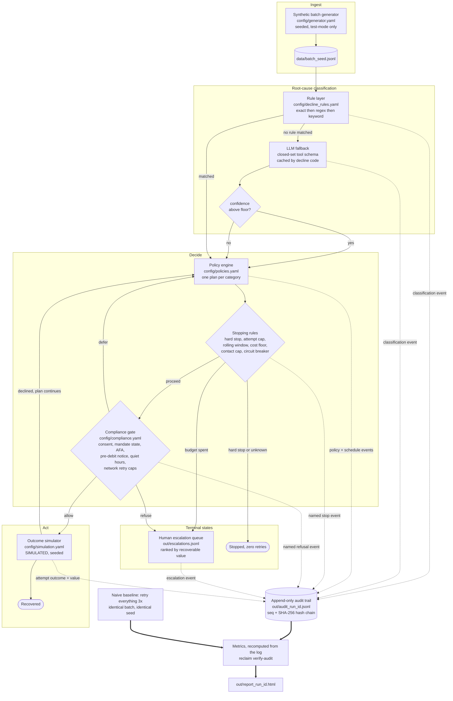

# ReclaimAgent

**Failed-payment root-cause and recovery agent.** Built for the Razorpay AI Builder
Internship 2026, Track 3: AI Revenue Recovery.

ReclaimAgent ingests a batch of failed payment transactions, classifies each failure by
root cause, routes each case down a recovery path matched to that cause, bounds every path
with explicit stopping rules, refuses to act when a compliance precondition is unmet,
escalates exhausted cases to a human queue with the reasoning attached, logs every decision
to an append-only audit trail, and reports **measured** recovery outcomes that can be
recomputed from that log alone.

> ### Simulated outcomes. Test data only.
>
> Every transaction is synthetic, generated from `config/generator.yaml` and marked
> `environment: test`. The engine refuses to process a record that is not.
>
> Every retry outcome is **simulated** from the probabilistic model in
> `config/simulation.yaml`. No payment gateway is contacted at any point. The rupee figures
> in this README and in the HTML report measure how the policy engine behaves against that
> model. **They are not production recovery results and must not be quoted as such.**
>
> Compliance constants in `config/compliance.yaml` that the author could not verify against
> a primary source are marked `unverified: true` and listed in
> [`COMPLIANCE_NOTES.md`](COMPLIANCE_NOTES.md). Nothing in this repository asserts a
> regulator's or a card network's figure as fact.

---

## The problem

A failed recurring payment is not one problem. It is at least six, and they want opposite
things from you.

A customer whose balance ran dry wants you to wait and try again after payday. An issuer
that soft-declined wants you to retry soon, and then stop, because the marginal value of
attempt four is close to zero. An expired card cannot be recovered by retrying at all, only
by the customer replacing the instrument. A stolen card and a revoked mandate must never be
retried, because each further attempt is at best wasted and at worst an unauthorised debit.
A gateway timeout is not about the customer at all and should be retried in minutes.

Most dunning systems collapse all six into one loop: retry three times, a day apart, and
give up. That loop burns network goodwill on cases it can never win, re-presents at the
worst possible moment on the ones it could, contacts customers who never consented, and
leaves nobody able to answer "why did we charge this card four times?".

ReclaimAgent's claim is narrow and testable: **routing by root cause, with hard stopping
rules and a compliance gate in front of every action, recovers more money with fewer
attempts than retrying everything three times** — and can prove it from an audit log.

## Architecture



The arrows into the audit trail are the point. Nothing decides anything without writing
down who decided, what it consulted, what it concluded and how many rupees were at stake.

## Quickstart

Requires Python 3.11+. No API key is needed: the full pipeline runs offline.

```bash
git clone <this repo> && cd ReclaimAgent
make demo
```

`make demo` creates a virtualenv, installs the package, generates a batch, runs the
recovery pipeline and the naive baseline, sweeps 30 independent seeds to check the result is
not a fluke, ablates each design decision to measure what it is worth, verifies the audit
trail, renders the HTML report and opens it. It takes about **25 seconds** of compute after
the install step.

Or step by step:

```bash
make install

reclaim generate --seed 42 --size 250       # -> data/batch_42.jsonl
reclaim run --batch data/batch_42.jsonl     # -> out/audit_<run_id>.jsonl, escalations, metrics
reclaim benchmark --seeds 30                # is the delta real? sweep 30 independent batches
reclaim ablate --seeds 12                   # which design decision earns the money?
reclaim report                              # -> out/report_<run_id>.html
reclaim replay --case @success              # the decision chain for one recovery
reclaim replay --case @stopped              # the decision chain for one correct refusal
reclaim verify-audit                        # prove every reported number from the log
reclaim verify-docs                         # prove every number in this README came from a run
reclaim queue                               # the human escalation queue
```

`--case @success` and `@stopped` pick the highest-value recovery and the highest-value
correctly-refused case automatically, so the demo never depends on a memorised case id.

### Running with the LLM classifier fallback

The rule layer resolves every mapped decline code. Codes it cannot match go to an Anthropic
model, constrained to the closed category set by a tool schema and rejected below a
confidence floor.

```bash
cp .env.example .env      # then put your key in it; .env is git-ignored
export ANTHROPIC_API_KEY=...
reclaim run --batch data/batch_42.jsonl --llm
```

`reclaim run` uses the fallback automatically when `ANTHROPIC_API_KEY` is set, and falls
back to rule-only when it is not. `--no-llm` forces the offline path, which is what CI and
the demo use, so **the demo cannot fail live because of a network or model problem.**

## Sample output

From an actual run: `reclaim run --batch data/batch_42.jsonl --no-llm`, seed 42, 250 cases,
run id `42-f7efa664`.

```
value at risk        : Rs     983,109.00  (250 cases)
compliance-refused   : Rs     149,917.00  (excluded from the denominator)
addressable value    : Rs     833,192.00
RECOVERED            : Rs     513,660.00  (61.65% of addressable, 101 cases)
charge attempts      :               385  (Rs 1,334.18 recovered per attempt)
cost of acting       : Rs       1,497.70  (net Rs 512,162.30)
hard stops honoured  : 22/22 with zero retries (100%)
escalated            : 115 cases, Rs 428,843.00 at risk
compliance refusals  : 83

Like-for-like on the 218 cases both strategies were permitted to work:
  ReclaimAgent : Rs   513,660.00 recovered on  365 charge attempts
  naive 3x     : Rs   481,618.00 recovered on  534 charge attempts
  DELTA        : Rs   +32,042.00 (+6.7%) on -169 attempts (-31.6%)
```

**+₹32,042 recovered on 169 fewer charge attempts**, over the identical batch, the identical
seed and the identical outcome simulator.

### The number that is not a win, reported anyway

Across the whole batch the naive baseline "recovered" ₹552,702 against ReclaimAgent's
₹513,660. That gap is not skill. On the 32 cases the compliance layer terminally refused —
revoked or inactive mandates, debits with no pre-debit notification on record, amounts above
the configured AFA threshold, authorisations past the network retry ceiling — the baseline
debited anyway and took ₹71,084 across 85 attempts this system had already refused to make.
The baseline also spent 66 attempts on hard-decline and revoked-mandate cases and 30 on
unclassified ones, recovering nothing at all.

That is why the headline is the like-for-like row and why the gross figure is printed next
to it rather than quietly dropped. A recovery agent that beats its baseline by ignoring the
rules has not solved the problem.

### Is that delta real, or one lucky batch?

A single seed's result is an anecdote. `reclaim benchmark --seeds 30` re-runs the identical
comparison over 30 independently generated batches of 250 cases and reports the
distribution, worst case included:

| | |
|---|---:|
| Seeds where ReclaimAgent recovers more | **30 / 30** |
| Seeds where it recovers less | 0 / 30 |
| Delta, median | **+11.0%** |
| Delta, mean | +18.2% |
| Delta, worst seed | **+0.7%** |
| Delta, best seed | +79.7% |
| Charge attempts, mean change | **−34.2%** |
| Hard stops honoured on every seed | **yes** |

Two things worth saying plainly about this table. The worst seed is +0.7%, which is close
enough to zero to be honest about: on an unlucky batch the advantage nearly vanishes, and
what survives is the 34% reduction in attempts. And the seed quoted throughout this README,
42, comes in at +6.7% — **below the median**. The headline is not the best case, it is a
below-average one that happened to be the first seed used.

The one row that is not a distribution is the last. Honouring hard stops is not a tuning
outcome, it is an invariant, so CI sweeps 12 seeds on every push and fails the build if a
single one of them ever retries a stolen card or a revoked mandate.

### Which part of the design earns the money?

The sweep shows the system wins. `reclaim ablate` shows *why*, by disabling one feature at a
time and re-running everything over the same 12 seeds:

| Variant | Recovered | Attempts | vs baseline | Recovery lost by removing it |
|---|---:|---:|---:|---:|
| **full ReclaimAgent** | ₹4,922,723 | 4,356 | +23.6% | reference |
| no root-cause routing | ₹4,041,752 | 4,861 | +2.0% | **−17.9%** |
| naive 24/48/72h timing | ₹4,137,995 | 4,506 | +2.0% | **−15.9%** |
| no customer nudges | ₹4,518,205 | 4,406 | +12.7% | **−8.2%** |
| no cost floor | ₹4,923,000 | 4,439 | +23.6% | +0.0% |

Routing by root cause is worth 17.9% of recovery and 11.6% of the attempt budget. Scheduling
against each cause's recovery curve rather than a flat 24-hour interval is worth another
15.9%. Customer nudges are worth 8.2%. Strip routing *and* timing and the advantage over the
naive baseline collapses from +23.6% to +2.0%, which is the whole thesis of this project
stated as a number.

The last row is the one worth reading carefully. **Removing the cost floor changes recovery
by essentially nothing, and increases attempts by 1.9%.** That is the correct result, not a
disappointing one: the cost floor is a spend-control rule, not a recovery rule, and it earns
its place in the attempts column rather than the rupees column. A table built to flatter the
design would not have surfaced that, so this one is built to.

Hard stops are honoured in every variant. No amount of feature removal produces a retry on a
stolen card, and CI asserts it.

### Recovery by root cause

| Root cause | Cases | At risk | Recovered | Rate | Charge attempts | Contacts | Escalated |
|---|---:|---:|---:|---:|---:|---:|---:|
| `INSUFFICIENT_FUNDS` | 82 | ₹298,784 | ₹108,352 | 36.3% | 150 | 88 | 34 |
| `ISSUER_SOFT_DECLINE` | 89 | ₹314,452 | ₹113,116 | 36.0% | 174 | 45 | 53 |
| `TECHNICAL_ERROR` | 27 | ₹279,267 | ₹277,627 | 99.4% | 43 | 0 | 4 |
| `EXPIRED_CARD` | 20 | ₹43,304 | ₹14,565 | 33.6% | 18 | 40 | 14 |
| `HARD_DECLINE` | 12 | ₹25,549 | ₹0 | 0% | **0** | 0 | 0 |
| `MANDATE_REVOKED` | 10 | ₹13,876 | ₹0 | 0% | **0** | 0 | 0 |
| `UNKNOWN` | 10 | ₹7,877 | ₹0 | 0% | **0** | 0 | 10 |

The three zeros in the attempts column are the graded result. Every hard-stop and
unclassified case reached a terminal state without a single retry, and `verify-audit`
proves it from the log rather than asserting it.

### Stopping rules that fired

| Rule | Times |
|---|---:|
| `max_attempts_per_case` | 73 |
| `hard_stop_category` | 22 |
| `card_network.max_retries_per_declined_authorisation` | 12 |
| `cost_floor` | 12 |
| `emandate.pre_debit_notification_lead_hours` | 12 |
| `unknown_requires_human` | 10 |
| `emandate.mandate_must_be_active` | 6 |
| `emandate.afa_exemption_threshold_paise` | 2 |

Compliance refusals, itemised, totalled 83: 39 on missing contact consent, 12 each on the
network retry ceiling, the daily contact cap and the pre-debit notification window, 6 on
inactive mandates and 2 above the AFA threshold. A refusal is a distinct outcome. It never
enters the recovery-rate denominator.

## What each component does

| # | Component | Where | What it guarantees |
|---|---|---|---|
| 1 | Synthetic data generator | `generate.py`, `config/generator.yaml` | Seeded and reproducible. The failure mix is one config table, not magic numbers. Every record is `environment: test`. |
| 2 | Root-cause classifier | `classify.py`, `config/decline_rules.yaml` | Deterministic rules first. The model is consulted only for unmapped codes, constrained to the closed set by a tool schema, and overruled below a confidence floor. Answers are cached by decline code. |
| 3 | Recovery policy engine | `policy.py`, `config/policies.yaml` | One declarative plan per category. No per-category branching in Python. Every stop names a rule. |
| 4 | Compliance layer | `compliance.py`, `config/compliance.yaml` | Named, sourced, editable constants. The engine refuses to act when a precondition is unmet and logs the refusal as its own outcome. |
| 5 | Outcome simulator | `simulate.py`, `config/simulation.yaml` | Seeded per case and attempt. Deliberately invisible to the policy engine, which acts on its own separate priors. |
| 6 | Escalation queue | `escalation.py` | Exhausted, refused and `UNKNOWN` cases reach a human with the full decision chain, the rule that fired, a recommended action and a priority rank. Written twice: `out/escalations.jsonl` is the working list a human opens, `out/escalations_<run_id>.jsonl` is that run's permanent copy. |
| 7 | Audit trail | `audit.py` | Append-only JSONL, monotonic sequence, SHA-256 hash chain. Editing or deleting an event is detectable. |
| 8 | Metrics | `metrics.py` | Computed from the log, never from memory. `verify-audit` re-derives every published number and diffs it. |
| 9 | CLI | `cli.py` | `generate`, `run`, `report`, `replay`, `verify-audit`, plus `benchmark`, `ablate`, `verify-docs`, `queue` and `events`. |
| 10 | Report | `report.py` | Self-contained HTML, no external requests, with two worked examples traced event by event. |

## Stopping rules

Every rule below is configured in `config/policies.yaml`, fires by name, and writes that
name into the audit log.

- **`hard_stop_category`** — `HARD_DECLINE` and `MANDATE_REVOKED` are terminal at the moment
  of classification. They are never scheduled, so they cannot accumulate an attempt. A test
  asserts the event sequence for these cases is exactly ingest, classify, select, stop.
- **`unknown_requires_human`** — an unclassified decline is escalated, never retried.
- **`max_attempts_per_case`** — the policy's charge budget for this run.
- **`rolling_window_attempt_cap`** — at most one charge per case per rolling 24 hours,
  except for categories the config exempts.
- **`cost_floor`** — stop when the expected value of the next attempt, using the engine's own
  prior, falls below its cost times a configured multiple. The engine cannot see the
  simulator, so this rule is genuinely deciding under uncertainty.
- **`contact_frequency_cap`** — per-customer daily and weekly contact caps from the
  compliance config. Terminal only when contact was the last remaining recovery path.
- **`quiet_hours`** — contact inside the configured local window is *deferred* to the next
  permitted instant, not cancelled, with a bounded deferral budget.
- **`network_retry_cap`** — an independent ceiling on attempts per declined authorisation,
  enforced on top of the policy cap.
- **`batch_circuit_breaker`** — halts the whole run and escalates every open case when the
  batch is failing far worse than the engine itself predicted. It needs both a near-total
  failure rate *and* a collapse against forecast, so the natural tail of a decay curve does
  not trip it but a dead acquirer does.

## Determinism and the audit trail

The audit log contains no wall-clock timestamps and no random identifiers. It runs on a
simulated clock derived from the batch, which is what lets a 170-hour backoff schedule
execute in under a second and what makes two runs over the same seed byte-identical. Wall
time lives in `out/manifest_<run_id>.json` instead.

```bash
reclaim verify-audit
```

checks sequence continuity, the SHA-256 hash chain, timestamp ordering, that every case has
exactly one ingest and one terminal event, that no attempt ever landed on a hard-stop or
unclassified case, that every stop and refusal names a rule, and finally that every field of
`out/metrics_<run_id>.json` recomputes from the JSONL alone. It runs in CI on a fixture run.

The same discipline is applied to this document. `reclaim verify-docs` takes every headline
figure quoted in this README, formats it exactly as the README presents it, and checks it
appears. CI regenerates the seed-42 run, the sweep and the ablation, then runs that check as
a gate, so **a change that moves a number and does not update the README fails the build.**
One stale figure in a README is enough to make a reader doubt the ones that are correct.

## Development

```bash
make check      # ruff, mypy --strict, pytest
make cov        # with coverage
make benchmark  # sweep 30 seeds and print the delta distribution
make ablate     # measure what each design decision is worth
make verify-docs # check every figure in README.md against the run on disk
make ci         # everything CI runs, including verify-audit and the seed sweep
```

173 tests, 94% line coverage, `ruff` and `mypy --strict` clean. Pydantic models for every
record and event; no bare dicts cross a module boundary.

## Further reading

- [`DECISIONS.md`](DECISIONS.md) — every choice the brief left open, and why it went that way.
- [`COMPLIANCE_NOTES.md`](COMPLIANCE_NOTES.md) — the compliance constants, with the
  unverified ones flagged.
- [`CHALLENGES.md`](CHALLENGES.md) — the technical obstacles actually hit while building
  this, and how they were solved.
- [`DEMO_SCRIPT.md`](DEMO_SCRIPT.md) — the five-minute video runsheet.
